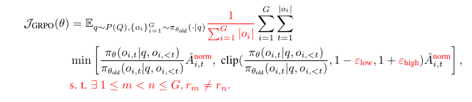

# Minimal Mistral-GRPO Implementation

Based on https://github.com/open-thought/tiny-grpo but adapted to the GRPO-Magistral style ([Magistral paper](https://mistral.ai/static/research/magistral.pdf)). You'll find some comments explaining things in the repo.



Nothing too complicated:

- Removes KL computations and reference-model passes
- Implements the two-stage advantage normalization exactly as in the prompt:
    1) Group baseline:     Â_i = r_i - μ_group
    2) Batch std-scaling:  Â_norm = (Â_i - μ_batch) / σ_batch
- Filters out "non-diverse" groups (returns.std() == 0)
- Loss is averaged over all tokens via `masked_mean(..., dim=None)`

Length penalty isn't implemented yet—just the core mathematics.

**Goal:** A working toy implementation of Llama-3.2-1B local RL training with GRPO. The aim is to understand the algorithm and hyperparameters, running everything locally on a single node.

### Setup

1. Create a conda environment:

```
conda create --name grpo python=3.12 -y
conda activate grpo
```

2. Install dependencies:

```
pip install -r requirements.txt
pip install flash-attn --no-build-isolation
```

3. Run the training script:

```
python train.py
```

### Inspiration

- [OpenRLHF](https://github.com/OpenRLHF/OpenRLHF)
- [Spinning Up in Deep RL](https://spinningup.openai.com/en/latest/)

### References

- [DeepSeek-R1 tech report](https://github.com/deepseek-ai/DeepSeek-R1/blob/main/DeepSeek_R1.pdf)
- [DeepSeekMath: Pushing the Limits of Mathematical Reasoning in Open Language Models](https://arxiv.org/abs/2402.03300)
